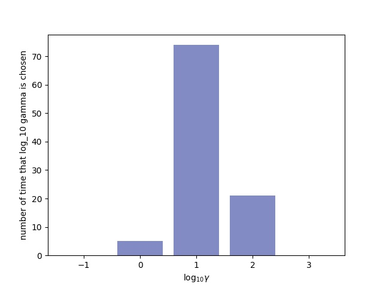

---
puppeteer:
    format: A4
export_on_save:
    puppeteer: true
---

## ML Techniques HW\#1

##### b07902055 謝宗晅

### Explicit versus Implicit

#### 1.

上面的點點是在 $\mathcal{Z}$ 空間裡面的所有點，然後黑色的線代表的是：$z_1 = -0.5$ 這條線。其中紅色的點代表 $y=-1$，綠色的點代表 $y = +1$。該條黑色的線很直覺的就是將平面分割開來最好的線。
並且如果將該結果放回原本的 $\mathcal{X}$ 空間的話，會變成：
$$\phi _1 (\mathbf{x}) = z_1 = -0.5 = x_2^2 - 2x_1 -2$$$$ \Rightarrow x_2^2 - 2x_1 - 1.5 = 0$$

#### 2.

我使用的是 sklearn 套件，將題目的座標輸入之後，設定 `kernel = 'poly', degree = 2, gamma = 1, coef0 = 1, C = 1e8, shrinking = False` 就可以開始做了 (`C = 1e8`：將 $C$ 設的很大，就可以視為是 hard margin SVM；`shrinking = False`：避免為了增加效能而將某些 vector 排除在外的可能性)。使用 `dual_coef_` 就可以看到最佳的 coefficients 是： $(0.64491963, 0.76220325, 0.88870349, 0.22988879, 0.2885306)$ (因為這個套件顯示的會是 $y_i \alpha _i$ 的乘積，因此要把它們的值取絕對值才會是上方的值)；使用 `support_` 就可以看到那些 support vectors 的 indices 各是多少：$1, 2, 3, 4, 5$
所以我們可以得到 $$\mathbf \alpha =  (0, 0.64491963, 0.76220325, 0.88870349, 0.22988879, 0.2885306, 0)$$
其中 support vectors 就是 $\alpha _i \neq 0$ 的那些，也就是 $$\mathbf x_2,\mathbf x_3,\mathbf x_4,\mathbf x_5,\mathbf x_6$$

#### 3.

首先，$$g(x) = \text{sign}\Big(\sum_{\text{support vector's }\alpha _i }y_i\alpha_iK(\mathbf{x}_i, \mathbf{x}) + b\Big)$$其中$$K(\mathbf{x}_i, \mathbf{x}) = (1 + \mathbf{x}_i^T\mathbf{x})^2$$$b$ 可以直接由 sklearn 的 `intercept_` 來知道，$y_i\alpha_i$ 已經在上一個題目獲得，但 $K(\mathbf x_i, \mathbf x)$ 沒辦法直接取得，因此把式子展開：(將 $\mathbf x _{i,1}$ 化簡為 $a_1$，將 $\mathbf x_{i, 2}$ 化簡為 $a_2$)$$\begin{aligned} K(\mathbf x_i, \mathbf x) &= (1 + \mathbf x_i^T\mathbf x )^2 \\&= 1 + 2\mathbf x_i^T\mathbf x + (\mathbf x_i^T\mathbf x)^2 \\ &= 1 + 2a_1x_1 + 2a_2x_2 + (a_1x_1 + a_2 x_2)^2\\&=1 + 2a_1 x_1 + 2a_2 x_2 + (a_1 x_1)^2 + 2a_1a_2 x_1 x_2 + (a_2 x_2)^2 \end{aligned}$$把每一項的係數總和都算出來之後就好了：$$g(x) = \text{sign}\big(-1.666 + -1.777x_1 + 0x_2 + 0.8887(x_1)^2 + 0x_1x_2 + 0.6665(x_2)^2\big)$$

#### 4.

如圖，這個是在 $\mathcal{X}$ 平面上面的所有點，其中，藍色的線代表的是第一題的曲線，紫色的線代表的是第三題的曲線，他們是不一樣的曲線。因為第三題的變換代表的是：$$\phi (\mathbf x ) = (1, \sqrt2 x_1, \sqrt2 x_2, x_1^2, x_2^2)$$顯然和第一題的變換是完全不同的變換，因此他們做出來的結果不同。

### Dual Problem of Soft-Margin Support Vector Machine with Per-Example Margin Goals

#### 5.

根據投影片的推導，我們可以得到很類似的結果，只是把式子中的 1 換成 $\rho_n$：$$\begin{aligned}  \mathcal L ((b, \mathbf w , \bm \xi), (\bm \alpha, \bm \beta))  &= \frac 1 2 \mathbf w ^T \mathbf w  + C\sum_{n = 1}^{N}\xi_n \\&+ \sum_{n = 1}^{N}\alpha_n(\rho_n - \xi _n - y_n(\mathbf w^T\mathbf x_n + b)) + \sum_{n = 1}^{N}\beta_n(-\xi_n) \end{aligned}$$

#### 6.

根據課本投影片，在求極值的過程中，有下列的偏微分式子：$$\begin{aligned}\frac{\partial \mathcal L}{\partial \xi_n} &= 0 = C-\alpha _n - \beta _n \implies\beta_n = C - \alpha_n \\& \implies \mathcal L = \frac 1 2 \mathbf w^T\mathbf w + \sum_{n= 1 }^N \alpha_n(\rho_n - y_n(\mathbf w^T\mathbf x_n + b))\text{  , where  } \beta_n = C - \alpha_n \\ \frac{\partial\mathcal L}{\partial b\ }\ &= 0 = \sum_{n = 1}^N \alpha_n(-y_n) = 0 \implies\sum_{n = 1}^N\alpha_ny_n = 0  \\&   \implies \mathcal L = \frac 1 2 \mathbf w^T \mathbf w + \sum_{n = 1}^N \alpha_n(\rho _n - y_n(\mathbf w^T\mathbf x_n)) \\&  \Big(\text{where  }\beta_n = C - \alpha_n\text{  , and  } \sum_{n = 1}^N \alpha_ny_n =0\Big)   \\  \frac{\partial\mathcal L}{\partial w_i} &= 0 = w_i - \sum_{n = 1}^N\alpha_ny_n\mathbf x_{n, i} \implies \mathbf w = \sum_{n = 1}^N \alpha_ny_n\mathbf x_n   \\&  \implies \mathcal L = \frac 1 2 \mathbf w^T\mathbf w + \sum_{n = 1}^N \alpha_n \rho_n - \mathbf w^T\mathbf w = -\frac 1 2\Big\|\sum_{n = 1}^N\alpha_ny_n\mathbf x_n\Big\|^2 + \sum_{n = 1}^N\alpha_n\rho_n  \\ &   \Big(\text{where }\beta_n = C - \alpha_n\text{  ,   }\sum_{n = 1}^N \alpha_n y_n = 0\text{  , and } \mathbf w = \sum_{n = 1}^N\alpha_ny_n\mathbf x_n\Big)\end{aligned}$$

**KKT Conditions :**
* primal feasible : $y_n(\mathbf w^T\mathbf x_n + b) \geq \rho_n - \xi_n$
* dual feasible : $\alpha_n \geq 0$
* dual-inner optimal : $\sum y_n\alpha_n = 0$ ; $\mathbf w = \sum\alpha_ny_n\mathbf x_n$
* primal-inner optimal : $\alpha_n(\rho_n - y_n(\mathbf w^T \mathbf x_n + b)) = 0$

#### 7.

我們所得到的 $P'_1$ 解答放到式子裡面就會是：$$\begin{aligned}\min_{\mathbf w, b, \bm \xi}\  & \frac 1 2 (\mathbf w'_*)^T\mathbf w'_* + C'\sum_{n=1}^N \xi_n \\ \text{s.t. } & y_n((\mathbf w'_*)^T\mathbf x_n + b'_*) \geq 0.5  - \xi_n \\ & \xi_n \geq 0\end{aligned}$$如果將下方的不等式左右邊都同乘 $2$，就會變成：$$\begin{aligned} & 2y_n((\mathbf w'_*)^T\mathbf x_n + b'_*) \geq 1  - 2 \xi_n \\ & \xi_n \geq 0 \\ \implies & y_n((2\mathbf w'_*)^T\mathbf x_n + 2b'_*) \geq 1 - 2\xi_n \\ & \xi_n \geq 0 \end{aligned}$$如果把這個新的 $\mathbf w$ 放到上方的 min 式子，就會變成：$$\min_{\mathbf w , b ,\bm \xi} \frac 1 2  (4 (\mathbf w'_*)^T\mathbf w'_*) + C\sum_{n = 1}^N(2\xi_n)$$就可以發現，如果將上方式子的 $C$ 令成 $2C'$，整個 $P_1$ 的 min 式子就會變成 $P_1'$ 的 min 式子的 $4$ 倍：$$\begin{aligned}&\text{if }C = 2 C' \text{ , then } P_1 : \\  & \min_{\mathbf w, b, \bm \xi}\ \frac 1 2  (4 (\mathbf w'_*)^T\mathbf w'_*) + C\sum_{n = 1}^N(2\xi_n) \\ = &\min _{\mathbf w , b , \bm \xi}\ 4\Big(\frac 1 2 (\mathbf w'_*)^T\mathbf w' _*\Big) + 4\Big(C'\sum_{n = 1}^N\xi_n\Big)  = \\ = & \min _{\mathbf w , b , \bm \xi}\ 4\Big(\frac 1 2 (\mathbf w'_*)^T\mathbf w'_* + C'\sum_{n = 1} ^N \xi_n\Big)\end{aligned}$$進而得到了 $P_1'$ 和 $P_1$ 是兩個等價問題的結論，因為 一個函數的 minimizer 在該函數乘以一個常數倍數之後，minimizer 依然不會變。
從上方的式子就可以看出如果 $(\mathbf w'_*, b_*')$ 是 $P_1'$ 的最佳解，則 $(\mathbf w_*, b_*) = (2 \mathbf w '_*, 2b_*')$，並且若 $P_1$ 的 $C = 2C'$ ( $P_1':C'$ )。

#### 8.

因為題目假設該 data set 在 $\mathcal Z$ 空間裡面是可分的，那就代表 $\mathbf \alpha^*$ 是以下式子的其中一個最佳解：$$\max_{\text{all }\alpha_n\geq 0, \sum y_n\alpha_n= 0}\Big(\min_{\mathbf w}\ \frac 1 2 \mathbf w^T\mathbf w + \sum_{n = 1}^N\alpha_n(1 - y_n(\mathbf w^T\mathbf z_n))\Big)$$其實也就等價於每一筆資料 $\mathbf z_n$ 對於 $\mathbf \alpha^*$ 的 $\xi_n$ 都會是 $0$ ( 如此一來 soft margin SVM 的式子中的 $\xi_n$ 都會消失 $\Rightarrow$ 與上方 hard margin SVM 的式子相同 )。那麼 $C$ 的用途就只剩下限制 $\alpha_n$ 的大小了，因此若 $C$ 不多做對於 $\alpha_n$ 大小的限制的話，hard margin 的最佳解就可以變成 soft margin 上的最佳解。
所以我們可以得到若 $$C \geq \max_{1 \leq n \leq N}\alpha^*_n$$則 hard margin 的最佳解與 soft margin 的最佳解等價。

#### 9.

**[a]** $K(\mathbf x, \mathbf x') = (1 - K_1(\mathbf x, \mathbf x'))$ : 不是 kernel function
反例：
假設 $M = \begin{bmatrix}0.4 & 0.6\\ 0.6 & 0.9\end{bmatrix}$ 代表的是 $K_1(\mathbf x , \mathbf x')$ 的矩陣，先證明這個矩陣是否為符合規定的：$$\begin{aligned}&M\text{ is symmetric, and}\\& \text{Let } \mathbf x = \begin{bmatrix}x_1 \\ x_2 \end{bmatrix}, x_1, x_2 \in \R \\ &\mathbf x^T M \mathbf x = 0.4x_1^2 + 1.2x_1x_2 + 0.9x_2^2 = (0.2x_1 + 0.3x_2)^2 \geq 0 \\ &\implies M \text{  is a positive semi-definite matrix} \end{aligned}$$令 $M_{[a]} = \begin{bmatrix}1 - 0.4 & 1 - 0.6 \\ 1 - 0.6 & 1 - 0.9\end{bmatrix} = \begin{bmatrix}0.6 & 0.4 \\ 0.4 & 0.1\end{bmatrix}$ 是代表 $(1 - K_1{\mathbf x, \mathbf x'})$ 的矩陣，則$$\begin{aligned}&\text{Let }\mathbf x = \begin{bmatrix}x_1 \\ x_2\end{bmatrix}, x_1, x_2 \in \R \\ & \mathbf x^T M_{[a]} \mathbf x = 0.6x_1^2 + 0.8x_1x_2 + 0.1x_2^2 \\ & \text{if }(x_1, x_2) = (1, -1), \text{then }\mathbf x^T M_{[a]} \mathbf x = -0.1 \end{aligned}$$因此這題的 kernel function 不是一個 valid 的 kernel function。

**[b]** $K(\mathbf x, \mathbf x') = (1 - K_1(\mathbf x, \mathbf x'))^0 = 1$ : 是 kernel function
證明：
因為$$K(\mathbf x , \mathbf x') = 1$$因此用來代表 $K$ 的矩陣會是$$M_{[b]} = \begin{bmatrix}1 & 1 & \cdots & 1 \\ 1 & 1 &\cdots  & 1 \\ \vdots & \vdots & \ddots & \vdots \\ 1 & 1 & \cdots & 1 \end{bmatrix}$$ 它是個對稱矩陣，並且對所有 $\mathbf x \in \R^n$ 都會有$$\begin{aligned}\mathbf x^T M_{[b]}\mathbf x = (x_1 + x_2 + \cdots + x_n )^2 \geq 0 \\ \implies M_{[b]} \text{  is a positive semi-definite matrix} \end{aligned} $$所以這是一個 valid 的 kernel function。

**[c]** $K(\mathbf x, \mathbf x') = \frac {1}{1 - K_1(\mathbf x, \mathbf x')}$ : 是 kernel function
證明：
將 $\frac {1}{1 - K_1(\mathbf x, \mathbf x')}$ 用泰勒展開表示的話：$$\frac 1 {1 - K_1(\mathbf x, \mathbf x')} = \sum_{n = 0} ^{\infty}(K_1(\mathbf x, \mathbf x'))^n$$也是一個合規定的 kernel function，理由如下：
$$
\begin{aligned}
&\text{Let } K_1(\mathbf x ,\mathbf x') = \phi_1(\mathbf x)^T\phi_1(\mathbf x) \text{ and } K_2(\mathbf x, \mathbf x') = \phi_2(\mathbf x)^T\phi_2(\mathbf x) \text{ be two valid kernels,} \\
& \text{and }M_1 , M_2 \text{ be their Gram matrix respectively,}\\
&\text{then }\ M_1 = A^TA,\ \ M_2 = B^TB \\
&\text{where }\ A =
\begin{bmatrix}
\mathbf a_1,\mathbf a_2, \cdots ,\mathbf a_n
\end{bmatrix}
, \ \ B =
\begin{bmatrix}
\mathbf b_1,\mathbf b_2, \cdots ,\mathbf b_n
\end{bmatrix}, \mathbf a_i = \phi_1(\mathbf x_i), \mathbf b_i = \phi_2(\mathbf x_i) \\
& \text{Let } K(\mathbf x, \mathbf x') = K_1(\mathbf x, \mathbf x')K_2(\mathbf x, \mathbf x') \\
& \text{then we can yield that the Gram matrix of } K(\mathbf x, \mathbf x') \text{ is } M = \begin{bmatrix}m_{ij}\end{bmatrix} \\
&\text{with } m_{ij} = \mathbf a_i^T\mathbf a_j\mathbf b_i^T\mathbf b_j  \\
& M \text{ is symmetric (trivial)} \\
& \text{Let } \mathbf x \in \R^n: \\
\end{aligned}
$$
$$
\begin{aligned}
\mathbf x^TM\mathbf x & = \sum_{i = 1}^n\sum_{j = 1}^nx_ix_j\mathbf a_i^T\mathbf a_j\mathbf b_i^T\mathbf b_j = \sum_{i = 1}^n\sum_{j = 1}^n x_ix_j\Big(\sum_{k = 1}^na_{i, k}a_{j, k}\Big)\Big( \sum_{l = 1}^n b_{i, l}b_{j , l} \Big) \\
& = \sum_{k, l}\sum_{i, j}x_ix_ja_{i, k}a_{j, k}b_{i, l}b_{j, l} \\
& = \sum_{k, l}\sum_{i = 1}^nx_ia_{i, k}b_{i, l}\sum_{j = 1}^nx_ja_{j, k}b_{j, l} \\
& = \sum_{k, l}\bigg(\sum_{i = 1}^nx_ia_ib_i\bigg)^2 \geq 0
\end{aligned}$$
因此我們可以得到結論：任何 valid kernel 相乘還會是 valid kernel，至於 valid kernel 的相加以及大於0的常數倍數都還是 valid kernel，證明如下：$$\begin{aligned} &\text{Let } \mathbf x \in \R^n, \text{ and } K_1(\mathbf x, \mathbf x'), K_2(\mathbf x, \mathbf x') \text{ be two valid kernels} \\ & \text{and }M_1, M_2 \text{ are their Gram matrix respectively} \\
& \implies \mathbf x^TM_1\mathbf x \geq 0 , \ \ \mathbf x^TM_2\mathbf x \geq 0 \\
& \implies \mathbf x^T(kM_1)\mathbf x \geq 0,\ \  \mathbf x^T(M_1  + M_2)\mathbf x \geq 0, \ \ \text{where } k > 0 \\
& \text{and } kM_1, (M_1 + M_2) \text{ are symmetric} \\
& \implies kK_1(\mathbf x, \mathbf x') \text{ and } (K_1(\mathbf x, \mathbf x') + K_2(\mathbf x, \mathbf x')) \text{ are valid kernels for } k > 0
\end{aligned}$$

**[d]** $K(\mathbf x, \mathbf x') = \frac{1}{(1 - K_1(\mathbf x, \mathbf x'))^2}$ : 是 kernel function
證明：
同樣是把它用泰勒展開寫出來，就會變成：$$
K(\mathbf x, \mathbf x') = \frac{1}{(1 - K_1(\mathbf x, \mathbf x'))^2} = \sum_{n = 1}^{\infty}n\Big(K(\mathbf x, \mathbf x')\Big)^{n - 1}
$$根據 [c] 選項的證明，就可以發現到這也是一個 valid kernel。

#### 10.

若有個 soft margin SVM 解出的 $g_{\text{SVM}}$ 如下：$$
g_{\text{SVM}}(\mathbf x) =
\text{sign}\Big(\sum_{\text{SV indices }n}\alpha_ny_nK(\mathbf x_n, \mathbf x) + b\Big)
$$
那麼如果將式子中的 $K(\mathbf x_n, \mathbf x)$ 替換成 $\tilde K(\mathbf x_n, \mathbf x) = pK(\mathbf x_n, \mathbf x)$，那麼 $\alpha_n$ 就會變成 $\tilde \alpha_n = \frac {\alpha_n} p$：$$
g_{\text{SVM}}(\mathbf x) =
\text{sign}\Big(\sum_{\text{SV indices } n }\tilde \alpha_n y_n\tilde K(\mathbf x_n, \mathbf x) + b\Big)
$$
接著來檢查看看改變 $K(\mathbf x_n, \mathbf x)$ 之後，我們所計算的 $b$ 會不會和原本有所不同：$$
\begin{aligned}
& \text{for a free SV } (\mathbf x_s, y_s) \text{ (free :  }\tilde \alpha_s < \tilde C)\\
& b = y_s - \sum_{\text{SV indices } n}\tilde \alpha_ny_n\tilde K(\mathbf x_n, \mathbf x_s)
\end{aligned}
$$
可以觀察到對於 "free support vector" 的定義，也和原先的 " $\alpha_s < C$ " 是相吻合的：$$
\frac {\alpha_s} p = \tilde\alpha_s < \tilde C = \frac C p
$$
而且對於每一個 $\alpha _n$，本來的限制 ( $0 \leq \alpha_n \leq C$ ) 也可以推到新的限制 ( $0 \leq \tilde \alpha_n \leq \tilde C$ )
因此就算將 $K(\mathbf x, \mathbf x')$ 變成 $\tilde K(\mathbf x , \mathbf x')$，所得到的 $g_{\text{SVM}}$ classifier 依然會是一樣的。

#### 11.

**Findings :**
可以發現到因為 $C$ 的限制逐漸放寬了，也代表 $\mathbf w$ 的長度可以越來越長，但是提升到一個上限之後似乎就停止了，因此我們可以得到一個結論：$\mathbf w$ 的長度 (複雜度) 會隨著 $C$ 的上升而越來越長 (越來越複雜)，但也不會無止盡的跟著 $C$ 向上成長，還是有一個長度的上界。

#### 12.

**Findings :**
隨著 $\mathbf w$ 的複雜度提高，$E_{\text{in}}$ 並沒有顯著的改變，可能的原因應該是隨著不同的 $C$，我們所得到的最佳 $\mathbf w$ 都是幾乎一樣的，只是 $\mathbf w$ 所選擇的 support vector 有所不同，使得 $\mathbf w$ 所張開的超平面的寬度有所變動。

#### 13.

參考：B07902123 蔡奇夆
**Findings :**
可以發現到承第 12 題，support vector 的數量隨著 $C$ 的變動而有所不同，在 $C = 0.001$ 之後的實驗，support vector 的數量逐漸減少，應該是因為 $\mathbf w$ 所張開的平面寬度逐漸變小，使得能罩住的 support vector 數量變小。至於在 $C = 10^{-5}$ 時，和同學討論的結果推測可能會是因為精準度不夠的緣故，使得有些 $\alpha$ 太小的 vector 直接被當作 $\alpha = 0$，使得判斷上有一些誤差。

#### 14.

**Findings :**
這題的圖片正好可以印證與 12 和 13 題類似的想法 (雖然使用的 kernel function 不同)，當 $C$ 的大小逐漸變大，超平面的複雜度逐漸變高，free support vector 到超平面的距離就也逐漸變小。

#### 15.

**Findings :**
隨著 $\gamma$ 的升高，$E_{\text{out}}$ 並沒有一致的趨勢，反而是在 $\gamma = 10$ 的時候有了最好的 $E_{\text{out}}$ 表現，因此可以得到 $\gamma$ 越大或越小不一定會讓預測變準確，必須使用剛剛好的 $\gamma$ 才能使預測表現最好。

#### 16.

**Findings :**
和上一題的結果一樣，因為 $\gamma = 10$ 的時候應該是最好的預測，所以 $\gamma = 10$ 被我們自行設計的 validation procedure 所挑選出來的次數也最多。

### Bonus

#### 17.

這題使用反證法，考慮一個 soft margin SVM，如果對於以下這個問題：$$\begin{aligned} & \min_{b ,\mathbf w} & \frac 1 2 \mathbf w^T\mathbf w + C\sum_{n = 1}^N \xi_n \\
&\text{s.t.} & y_n(\mathbf w^T\mathbf z_n + b) \geq 1 - \xi_n \\ & & \text{and } \xi_n \geq 0\  \text{ for all } n\end{aligned}$$的最佳解是 $(\mathbf w_*, b_*)$，其中對應到所有常數的特徵轉換 index 的集合是 $S_{\text{constant}}$，並且對於所有 $i \in S_{\text{constant}}$，$z_i$ 的權重 $w_{*i} \neq 0$，那麼我們可以構造出一個更好的最佳解：
令 $$\begin{aligned}&b' = b_* + \sum_{i \in S_{\text{constant}}}z_iw_{*i} \\ & \mathbf w' = \begin{pmatrix}w_k\end{pmatrix}, \text{where } w_k = \begin{cases}0&, \text{if } k \in S_{\text{constant}} \\ w_{*k}&, \text{if } k \notin S_{\text{constant}} \end{cases}\end{aligned}$$
則 $(\mathbf w', b')$ 是一個更好的最佳解：
先檢查 $(\mathbf w', b')$ 是否滿足題目的要求：$$\begin{aligned}y_n(\mathbf w^T_*\mathbf z_n  + b_*)  &= y_n\Bigg(\sum_{i \in S_{\text{constant}}}w_{*i}z_i + \sum_{j\notin S_{\text{constant}}} w_{*j}z_j + b_*\Bigg) \\ &=y_n\Bigg( \sum_{j \notin S_{\text{constant}}} w_{*j}z_j + b'  \Bigg) \\ &=y_n\Bigg(\sum_{i = 1}^Nw'_jz_j + b'\Bigg) \\ &=y_n((\mathbf w')^T\mathbf z_n + b') \geq 1 - \xi_n \\ & \text{and } \xi \geq 0\  \text{ for all }n\end{aligned}$$
但是$$\begin{aligned}\frac 1 2 \mathbf w_*^T\mathbf w_* &= \frac 1 2\Bigg( \sum_{i \in S_{\text{constant}}} w_{*i}^2  + \sum_{j \notin S_{\text{constant}}}w_{*j}^2 \Bigg) \\ &>\frac 1 2 \Bigg(\sum_{j\notin S_{\text{constant}}}w_{*j}^2 \Bigg) = \frac 1 2 (\mathbf w')^T\mathbf w' \end{aligned}$$
因此可以發現到 $(\mathbf w_*, b_*)$ 不是最佳解，最佳解會是對於所有常數特徵轉換的 $w_i$ 權重都為 0 的 $(\mathbf w', b')$。

#### 18.

Hard margin SVM 的對偶問題：$$\begin{aligned}\min_{\bm \alpha}\ & \frac 1 2 \bm\alpha^T Q\bm \alpha -1_N^T\bm\alpha \\
\text{subject to }&\mathbf y^T\bm\alpha = 0, \\ &\alpha_n \geq 0 \text{ for all } \alpha_n \\ &\text{where } Q = \begin{bmatrix} q_{n, m}\end{bmatrix} , \ \ q_{n, m } = y_ny_m\mathbf x_n^T\mathbf x_m\end{aligned}$$使用拉格朗日乘數，就可以得到：
$$\min_{\bm\alpha} \max_{\lambda_i \geq 0}\frac 1 2 \bm\alpha^T Q\bm \alpha
 -1^T_N\bm\alpha - \lambda_0\mathbf y^T\bm\alpha - \bm\lambda^T\bm\alpha $$假設這個問題具有強對偶性，則上方的式子就等於：$$\max_{\lambda_i\geq 0} \min_{\bm\alpha} \frac 1 2 \bm \alpha^T Q \bm\alpha  - 1^T_N \bm\alpha  - \lambda_0 \mathbf y^T\bm\alpha  - \bm \lambda^T\bm\alpha$$我們求上列式子對於 $\bm\alpha$ 的偏微分：$$\begin{aligned}&\frac {\partial \mathcal L}{\partial \bm\alpha} = Q\bm\alpha - 1^T_N - \lambda_0 \mathbf y - \bm\lambda = 0 \\ &\implies Q\bm\alpha = 1^T_N + \lambda_0\mathbf y + \bm\lambda \\ &\implies \text{if Q is invertible, then }\bm\alpha = Q^{-1}(1^T_N + \lambda_0\mathbf y +\bm\lambda)\end{aligned}$$再將以上結果代回去式子中，因此原本的問題轉為：$$\begin{aligned}&\max_{\lambda_i \geq 0} \frac 1 2\bm\alpha^T(1^T_N + \lambda_0\mathbf y + \bm\lambda) - 1^T_N\bm\alpha - \lambda_0\mathbf y^T\bm\alpha - \bm\lambda^T\bm\alpha\\ &  = \max_{\lambda_i\geq 0} -\frac 1 2 \bm\alpha^T(1^T_N + \lambda_0\mathbf y + \bm\lambda) \\ & = \max_{\lambda_i \geq 0 } -\frac 1 2 (1^T_N + \lambda_0\mathbf y + \bm\lambda)^TQ^{-1}(1^T_N + \lambda_0\mathbf y + \bm\lambda) \\ &\text{subject to } \lambda_i \geq 0, \ \ \forall i \in \{0, 1,\cdots , N\} \end{aligned}$$再把負號提出來，就變成和原本問題蠻相似的問題：$$\begin{aligned}&\min_{\lambda_i \geq 0} \frac 1 2 (1^T_N + \lambda_0\mathbf y + \bm\lambda)^TQ^{-1}(1^T_N + \lambda_0\mathbf y + \bm\lambda) \\ &\text{subject to } \lambda_i \geq 0, \ \ \forall i \in \{0, 1, \cdots, N\} \end{aligned}$$
