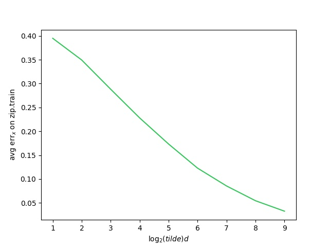
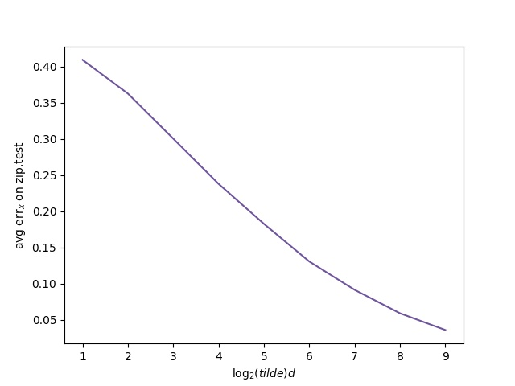
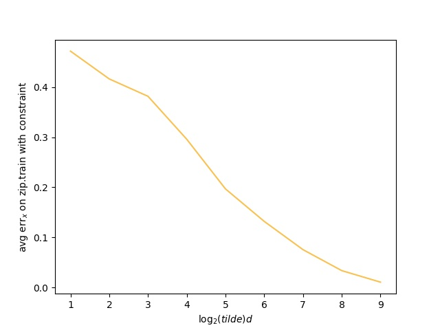
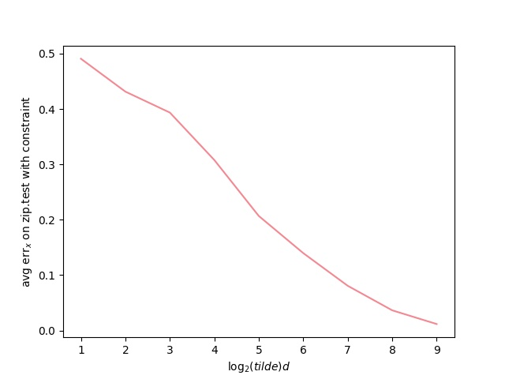
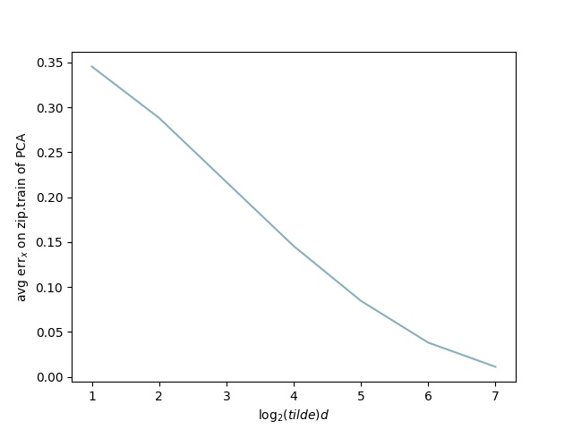
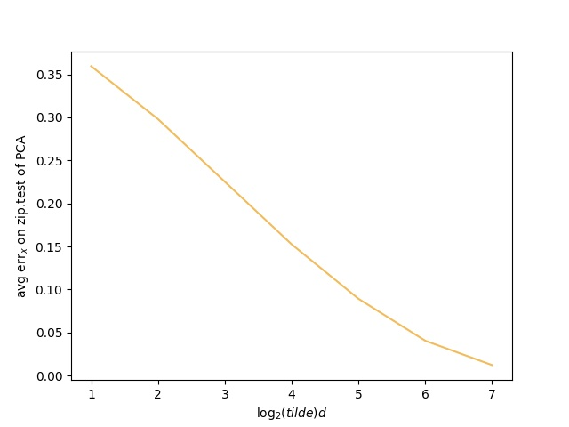
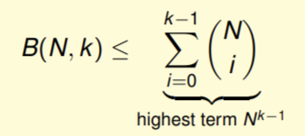

## Machine Learning Techniques HW\#2

##### By b07902055 謝宗晅

### Descent Methods for Probabilistic SVM

#### 1.

將題目的 notation 代入式子之後偏微分：$$\begin{aligned}
F(A, B) &= \frac 1 N \sum_{n=1}^N\ln \Big(1 + \exp\Big(-y_n\Big(A \cdot z_n + B\Big)\Big)\Big) \\ \implies \nabla F(A,B) &= \bigg(\frac {\partial F}{\partial A}, \frac {\partial F}{\partial B}\bigg) \\  \frac{\partial F}{\partial A} &= \frac 1 N \sum_{n=1}^N\bigg(\frac{\exp(-y_n(A\cdot z_n + B ))(-y_nz_n)}{1+\exp(-y_n(A\cdot z_n + B)) }\bigg) \\ & = \frac 1 N \sum_{n=1}^N-y_np_nz_n \\ \frac {\partial F}{\partial B} & = \frac 1 N \sum_{n=1}^N \bigg(\frac{\exp(-y_n(A\cdot z_n + B ))(-y_n)}{1+\exp(-y_n(A\cdot z_n + B)) }\bigg) \\ &= \frac 1 N \sum_{n=1}^N-y_np_n
\end{aligned}$$
因此他的 gradient 就是：$$
\nabla F(A, B) = \bigg(\frac 1 N \sum_{n=1}^N -y_np_nz_n, \frac 1 N \sum_{n=1}^N-y_np_n\bigg)$$

#### 2.

因為在 $y_n$, $p_n$, $z_n$ 之中，只有 $p_n$ 是和 $A$, $B$ 有關的，因此我們將 $p_n$ 分別對 $A$, $B$ 偏微分看看：
先將 $p_n$ 化簡成相對比較好微分的形式：$$p_n = 1 - \frac{1}{1 + \exp(-y_n(Az_n+B))}$$接著就開始偏微分：$$\begin{aligned} \frac {\partial p_n}{\partial A} &= -\bigg(-\frac{\exp(-y_n(Az_n+B))(-y_nz_n)}{(1+\exp(-y_n(Az_n+B)))^2}\bigg) \\ &= \frac{-p_ny_nz_n}{1 + \exp(-y_n(Az_n + B))} \\ &= -p_ny_nz_n(1-p_n) \end{aligned}$$$$\begin{aligned} \frac{\partial p_n}{\partial B} &= -\bigg(-\frac{\exp(-y_n(Az_n+B))(-y_n)}{(1 + \exp(-y_n(Az_n+B)))^2}\bigg) \\ &= \frac{-p_ny_n}{1 + \exp(-y_n(Az_n+B))} \\ &=-p_ny_n(1-p_n)
 \end{aligned}$$
接著我們來計算 Hessian 矩陣：
$$\begin{aligned}H(F) &= \begin{bmatrix} \frac{\partial^2F}{\partial A^2} & \frac{\partial^2F}{\partial A\partial B} \\ \\ \frac{\partial^2F}{\partial B\partial A} &
\frac{\partial^2F}{\partial B^2}
\end{bmatrix} \\ &= \begin{bmatrix}
\frac 1 N \sum_{n=1}^N {p_n(1-p_n)(y_nz_n)^2} & \frac 1 N \sum_{n=1}^N {p_n(1-p_n)(y_n)^2z_n} \\ \\
\frac 1 N\sum_{n=1}^N{p_n(1-p_n)(y_n)^2z_n} &
\frac 1 N\sum_{n=1}^N{p_n(1-p_n)(y_n)^2}
\end{bmatrix}\end{aligned}$$

#### 3.

對於任意的 $\mathbf x \in \R^2$ 如果以下的式子成立的話，那麼 $H(F)$ 就是一個半正定矩陣：$$\mathbf x^T H \mathbf x \geq 0$$令$$\mathbf x = \begin{bmatrix}x_1 \\ x_2\end{bmatrix}$$則$$\begin{aligned}
\mathbf x^T H \mathbf x &=\frac 1 N\sum_{n=1}^N\Bigg(p_n(1-p_n)\Bigg)\Bigg(x_1^2(y_nz_n)^2 +x_1x_2(y_n)^2(2z_n) + x_2^2(y_n)^2 \Bigg) \\ &=\frac 1 N \sum_{n=1}^N\bigg(p_n(1-p_n)(y_n)^2\bigg)\bigg((x_1z_n)^2 + 2(x_1z_n)x_2 + x_2^2\bigg) \\ &=\frac 1 N \sum_{n = 1}^N \bigg(y_n^2p_n(1 - p_n)\bigg)\bigg(x_1z_n + x_2\bigg)^2 \geq 0\end{aligned}$$
因為式子中的 $p_n$ 的範圍是 $0 < p_n < 1\ \  (0 < \theta(s) < 1,\ \forall s \in \R)$，所以 $p_n(1-p_n) > 0$，式子的其他部份都是平方項，因此一定大於等於 $0$，得證 $H(F)$ 是一個半正定矩陣。

### Neural Network

#### 4.

令 $x_0 = +1$，且$$w_i = \begin{cases}d - 1 & \text{if } i =0 \\ +1 & \text{else}\end{cases}$$則$$g_A(\mathbf x) = \text{sign}\bigg(\sum_{i=0}^dw_ix_i\bigg)$$就會是 $\text{OR}(x_1, x_2, \cdots , x_d)$，因為只有當 $-1 = x_1 = x_2 = \cdots = x_d$ 時，才會使得 $g_A(\mathbf x) = -1$
( 可以簡單的從 $d - 1 + (d\times-1)<0$ 得知 )
而且只要有至少一個 $x_i$ 是 $+1, \text{True}$ 的話，就會使得 $g_A(\mathbf x) = +1$，因為
$$d - 1 + (-1)(d-k) + 1(k)=2k-1 > 0,\ \ \forall k \in\N,\ k> 0$$因此這是可以實作 $\text{OR}(x_1, x_2,\cdots, x_d)$ 的方法之一。

#### 5.

題目要求我們列出所有為 $0$ 的 gradient component，根據投影片，我們有以下的關係式：
$$ \text{Error}=E = (y - \text{NNET}(\mathbf x))^2 = (y - \tanh(s_1^{(L)})) ^2$$先看看 output layer 的偏微分：$(0 \leq i \leq d^{(L-1)})$
$$\begin{aligned}
\frac{\partial E}{\partial w_{i1}^{(L)}} &= \frac{\partial E}{\partial s_1^{(L)}}\cdot\frac{\partial s_1^{(L)}}{\partial w_{i1}^{(L)}} \\
&= -2 \Big(\text{sech}^2\big(s_1^{(L)}\big) \Big)\Big(y-\tanh\big(s_1^{(L)}\big) \Big) \cdot \Big(x_i^{(L-1)}\Big)\\
&= \begin{cases} -2 \Big(\text{sech}^2\big(s_1^{(L)}\big) \Big)\Big(y-\tanh\big(s_1^{(L)}\big) \Big) &\text{, if }i=0 \\ 0 \ \ \ \text{ ( since all } x_i^{(L-1)}=0 \text{ where } i \neq 0\ )  & \text{, if } i \neq 0 \end{cases} \end{aligned}$$$$\implies \frac{\partial E}{\partial w_{01}^{(L)}} \neq 0$$
再來看看其他 $l$ 的情況：
$(1 \leq l < L , 0 \leq i \leq d^{(l-1)}, 0 \leq j \leq d^{(l)})$
$$\begin{aligned}\frac{\partial E}{\partial w_{ij}^{(l)}} &= \frac{\partial E}{\partial s_j^{(l)}} \cdot \frac{\partial s_j^{(l)}}{\partial w_{ij}^{(l)}} \\
&= \delta_j^{(l)}\cdot \Big(x_{i} ^{(l - 1)}\Big) \\
&\text{where } \delta_j^{(l)} = \frac{\partial E}{\partial s_j^{(l)}} \end{aligned}$$
根據投影片的推導，我們有下列的式子：$$\begin{aligned}
\delta_j ^{(l)} = \frac{\partial E}{\partial s_j^{(l)}} &= \sum_{k = 1}^{d^{(l + 1)}} \frac{\partial E}{\partial s_k^{(l + 1)}} \frac{\partial s_k^{(l + 1)}}{ \partial x_j^{(l)}} \frac{\partial x_j^{(l)}} {\partial s_j^{(l)}} \\
&= \sum_{k=1}^{d^{(l+1)}}(\delta_k^{(l + 1)}) (w_{jk}^{(l + 1)}) (\text{sech}^2(s_j^{(l)})) \\
&= \sum_{k=1}^{d^{(l+1)}}(\delta_k^{(l + 1)}) (0) (\text{sech}^2(s_j^{(l)})) \\
&= 0\end{aligned}$$$$\text{since all }w_{jk}^{(l + 1)} = 0\ ,\text{ then all } \delta_j^{(l)} = 0 \text{ , therefore all } \frac{\partial E}{\partial w_{ij}^{(l)}} = 0$$
因此所有的 gradient component 之中，只有 $\frac{\partial E}{\partial w_{01}^{(L)}} \neq 0$。

#### 6.

依照題目的要求，這個 neural network 會是 "$12-(d^{(1)}+1)-\cdots-(d^{(L-1)} + 1)-1$" 的一個架構，滿足$$\sum_{l = 1}^{L-1}\Big(d^{(l)} + 1\Big) = 48$$
那麼，這個 neural network 的 number of weights 就是：
$$\begin{aligned} N(\mathbf d) = & 12d^{(1)} + (d^{(1)} + 1)(d^{(2)}) + \cdots + (d^{(L-1)} + 1) \\
= &12d^{(1)} + d^{(1)}d^{(2)} + d^{(2)}+d^{(2)}d^{(3)}+\cdots+d^{(L-2)}d^{(L-1)} + 2d^{(L-1)} + 1\end{aligned}$$
而且一層的 hidden layer 至少要有兩個 neuron (包含了從上一層得到的輸入以及 $x_0^{(l)}$，因此每一層至少要有兩個 neuron，也就是說層數最多只有 48/2=24 層)，因此我用簡單的程式來窮舉每一 $L$，每一種排列可能的結果並找出最大值，code 的簡略版本如下 (完整版在 code 的資料夾裡面的 `6.py`)：
```python
# calculate number of weights
def my_func(my_list):

# recursively run through every combination of number of hidden neuron
def recursion(my_list, available, current_layer, max_layer):

max_hidden_L = 24
max_hidden_neuron = 48
my_max = 0
max_list = []
for l in range(1, max_hidden_L + 1):
    recursion([], max_hidden_neuron, 0, l)
    print(f'***** iteration: l = {l}')
    print(f'current : my_max = {my_max}, max_list = {max_list}\n')

print(f'my_max = {my_max}, max_list = {max_list}')
```

得到的答案是 `my_max = 877, max_list = [29, 19]`，

<!-- 使用 Lagrange Multiplier，就會得到以下的式子：
$$\mathcal L (\mathbf d) = N(\mathbf d) + \lambda\sum_{l=1}^{L-1}\Big(d^{(l)} + 1\Big)$$$$\begin{aligned}
\nabla\mathcal L (\mathbf d) = \begin{bmatrix}
d^{(2)} + 12 \\
d^{(1)} + d^{(3)} + 1 \\
d^{(2)} + d^{(4)} + 1 \\
\vdots \\
d^{(L-2)} + 2
\end{bmatrix} + \lambda \begin{bmatrix}
1 \\
1 \\
1 \\
\vdots \\
1\end{bmatrix}\end{aligned}$$先考慮 $L-1 = 1$ 的情況：
$$\begin{aligned} d^{(1)} &= 48 \\
 N(\mathbf d) &= 12\times 47 + 48\\
&=612 \end{aligned}$$再考慮 $L-1 = 2$ 的情況：
$$\begin{aligned} &\nabla\mathcal L (\mathbf d) = \begin{bmatrix} d^{(2)} + 12 \\
d^{(1)} + 2  \end{bmatrix}
+\lambda \begin{bmatrix}1 \\ 1\end{bmatrix} = \mathbf 0 \\
&\implies d^{(1)} = d^{(2)} + 10 \\
&\implies \begin{cases} d^{(1)} = 28 \\ d^{(2)} = 18 \end{cases} \\ &\implies N(\mathbf d) = 12\times 27 + 28\times 17 + 18 + 1 = 819 \end{aligned}$$接著我們看看 $L - 1 = 3$ 的情況：
$$\nabla\mathcal L(\mathbf d) = \begin{bmatrix}d^{(2)} + 12 \\
d^{(1)} + d^{(3)} + 1 \\
d^{(2)} + 2 \end{bmatrix} + \lambda\begin{bmatrix}1 \\1 \\ 1\end{bmatrix} = \mathbf 0$$因為上面的方程式無解，因此我用程式來尋找最佳解：
```python
def my_func(a, b, c):
    return 12*a + a*b + b*c + c

my_max = 0
max_set = []
for a in range(1, 48):
    for b in range(1, 48 - a):
        c = 48 - a - b
        if my_func(a, b, c) > my_max:
            max_set = [a, b, c]
            my_max = my_func(a, b, c)

print(f'my_max = {my_max}, max_set = {max_set}')
```
得到的答案是最大值 $889$ -->

#### 7.

對 $\text{err}_n(\mathbf w)$ 偏微分就可以得到答案：
$$\begin{aligned}\frac {\partial\text{err}_n} {\partial w_i}
&= \frac{\partial }{\partial w_i} \Big( \mathbf x_n - \mathbf w \mathbf w ^T \mathbf x_n \Big)^T \Big( \mathbf x_n - \mathbf w \mathbf w^T \mathbf x_n \Big) \\
&= \frac{\partial }{\partial w_i} \sum_{j=1}^d \Big( x_{j,n} - \sum_{k=1}^d x_{k,n} (\mathbf w \mathbf w^T)_{j,k} \Big)^2 \\
&= \frac{\partial }{\partial w_i} \sum_{j=1}^d \Big( x_{j,n} - \sum_{k=1}^d w_jw_k x_{k,n} \Big)^2 \\
&\Rightarrow \begin{cases} 2 \Big( x_{i,n} - \sum_{k=1}^d w_iw_k x_{k,n} \Big) \Big(- 2w_{i}x_{i,n} -\sum_{k\neq i} w_kx_{k,n} \Big) & \text{ , if } j = i \\
 2 \Big( x_{j,n} - \sum_{k=1}^d w_jw_k x_{k,n} \Big) \Big( - w_jx_{i,n} \Big) & \text{ , if } j \neq i \end{cases} \\
&= \sum_{j=1}^d  \Bigg( 2 \Big( x_{j,n} - \sum_{k=1}^d w_jw_k x_{k,n} \Big) \Big( - w_jx_{i,n} \Big) \Bigg) + 2 \Big( x_{i,n} - \sum_{k=1}^d w_iw_k x_{k,n} \Big) \Big(- w_{i}x_{i,n} -\sum_{k\neq i} w_kx_{k,n} \Big) \\
&= \sum_{j=1}^d  \Bigg( 2 \Big( x_{j,n} - \sum_{k=1}^d w_jw_k x_{k,n} \Big) \Big( - w_jx_{i,n} \Big) \Bigg) + 2 \Big( x_{i,n} - \sum_{k=1}^d w_iw_k x_{k,n} \Big) \Big(-\sum_{k=1}^d w_kx_{k,n} \Big) \\
&= -2\mathbf w^T \Big( \mathbf x_n - \mathbf w \mathbf w^T \mathbf x_n \Big) (\mathbf x_n)_i - 2(\mathbf w^T \mathbf x_n \mathbf x_n)_i + 2 (\mathbf w^T \mathbf x_n)(\mathbf w^T \mathbf x_n)\mathbf w_i \\
&= \Big(2 \mathbf w^T\mathbf w \mathbf w^T\mathbf x_n -4\mathbf w^T\mathbf x_n \Big)(\mathbf x_n)_i + 2 (\mathbf w^T \mathbf x_n)(\mathbf w^T \mathbf x_n)\mathbf w_i \\
\implies & \nabla_{\mathbf w}\text{err}_n(\mathbf w) = \Big(2 \mathbf w^T\mathbf w \mathbf w^T\mathbf x_n -4\mathbf w^T\mathbf x_n \Big)\mathbf x_n + 2 (\mathbf w^T \mathbf x_n)^2\mathbf w \\
\end{aligned}$$

#### 8.

首先先將式子展開：
$$\begin{aligned}E_{\text{in}}(\mathbf w) =& \frac 1 N \sum_{n=1}^N \Big\| (\mathbf x_n - \mathbf w \mathbf w^T\mathbf x_n) - \mathbf w \mathbf w^T \bm \epsilon_n  \Big\| ^2 \\  =& \frac 1 N \sum_{n=1}^N \Big( (\mathbf x_n - \mathbf w \mathbf w^T\mathbf x_n) - \mathbf w \mathbf w^T \bm \epsilon_n \Big)^T \Big( (\mathbf x_n - \mathbf w \mathbf w^T\mathbf x_n) - \mathbf w \mathbf w^T \bm \epsilon_n \Big) \\
=& \frac 1 N \sum_{n=1}^N \Bigg(\Big(\mathbf x_n - \mathbf w\mathbf w^T\mathbf x_n\Big)^T\Big(\mathbf x_n - \mathbf w\mathbf w^T\mathbf x_n\Big) - 2\Big(\mathbf x_n - \mathbf w \mathbf w^T\mathbf x_n\Big)^T\Big(\mathbf w \mathbf w^T\bm \epsilon_n\Big) \Bigg) \\
&+ \frac 1 N \sum_{n=1}^N \Big(\mathbf w \mathbf w^T\bm\epsilon_n \Big)^T\Big(\mathbf w \mathbf w^T \bm\epsilon_n \Big) \\
=& \frac 1 N \sum_{n=1}^N \Bigg( \Big\|\mathbf x_n - \mathbf w \mathbf w^T \mathbf x_n\Big\| ^2 - 2\Big(\mathbf x_n - \mathbf w \mathbf w^T\mathbf x_n\Big)^T\Big(\mathbf w \mathbf w^T\bm \epsilon_n\Big)  + \Big\|\mathbf w\mathbf w ^T\bm\epsilon_n\Big\| ^2 \Bigg) \end{aligned}$$接著我們計算期望值：
$$\begin{aligned}\mathbb E [E_{\text{in}}(\mathbf w)] =& \mathbb E\Bigg[ \frac 1 N \sum_{n=1}^N \Bigg( \Big\|\mathbf x_n - \mathbf w \mathbf w^T \mathbf x_n\Big\| ^2 - 2\Big(\mathbf x_n - \mathbf w \mathbf w^T\mathbf x_n\Big)^T\Big(\mathbf w \mathbf w^T\bm \epsilon_n\Big)  + \Big\|\mathbf w\mathbf w ^T\bm\epsilon_n\Big\| ^2 \Bigg)\Bigg] \\
=& \mathbb E \Bigg[ \frac 1 N \sum_{n=1}^N \Big\|\mathbf x_n - \mathbf w \mathbf w^T \mathbf x_n\Big\| ^2 \Bigg] - \mathbb E \Bigg[ \frac 1 N \sum_{n=1}^N 2\Big(\mathbf x_n - \mathbf w \mathbf w^T\mathbf x_n\Big)^T\Big(\mathbf w \mathbf w^T\bm \epsilon_n\Big) \Bigg]  \\
&+\mathbb E \Bigg[ \frac 1 N \sum_{n=1}^N \Big\|\mathbf w\mathbf w ^T\bm\epsilon_n\Big\| ^2 \Bigg] \\
=& \frac 1 N\sum_{n=1}^N \Big\|\mathbf x_n - \mathbf w \mathbf w^T \mathbf x_n\Big\| ^2 - \frac 1 N \sum_{n=1}^N 2\Big(\mathbf x_n - \mathbf w \mathbf w^T\mathbf x_n\Big)^T\Big(\mathbf w \mathbf w^T (\mathbb E [\bm \epsilon_n])\Big) \\ &+\mathbb E \Bigg[ \frac 1 N \sum_{n=1}^N \Big\|\mathbf w\mathbf w ^T\bm\epsilon_n\Big\| ^2 \Bigg] \\
=& \frac 1 N \sum_{n=1}^N \Big\|\mathbf x_n - \mathbf w \mathbf w^T \mathbf x_n\Big\| ^2 - 0 \text{ ( since every } \mathbb E[\epsilon_{i, n}] = 0\ )  \\
&+ \frac 1 N \sum_{n=1}^N \mathbb E\Bigg[ \sum_{i = 1} ^d \sum_{j = 1}^d \sum_{k = 1}^d (\epsilon_{i, n}w_jw_k)^2 \Bigg] \\
=& \frac 1 N \sum_{n=1}^N \Big\|\mathbf x_n - \mathbf w \mathbf w^T \mathbf x_n\Big\| ^2 + \frac 1 N \sum_{n=1}^N\mathbb E\Bigg[ \sum_{j=1}^d \sum_{k=1}^d \sum_{i=1}^d(\epsilon_{i, n})^2(w_jw_k)^2 \Bigg] \\
=& \frac 1 N \sum_{n=1}^N \Big\|\mathbf x_n - \mathbf w \mathbf w^T \mathbf x_n\Big\| ^2 + \frac 1 N \sum_{n=1}^N \sum_{j=1}^d \sum_{k=1}^d \sum_{i=1}^d \mathbb E \Big[ (\epsilon_{i, n})^2 \Big](w_jw_k)^2 \\
=& \frac 1 N \sum_{n=1}^N \Big\|\mathbf x_n - \mathbf w \mathbf w^T \mathbf x_n\Big\| ^2 + \frac 1 N \sum_{n=1}^N \sum_{j=1}^d \sum_{k=1}^d (w_jw_k)^2 \text{ , since } \mathbb E[\epsilon^2] = 1 \\
=& \frac 1 N \sum_{n=1}^N \Big\|\mathbf x_n - \mathbf w \mathbf w^T \mathbf x_n\Big\| ^2 + \frac 1 N \sum_{n=1}^N \mathbf w^T\mathbf w \mathbf w^T \mathbf w\\
\implies& \Omega(\mathbf w) = \mathbf w \mathbf w^T \mathbf w \mathbf w^T = \Big\|\mathbf w \mathbf w^T\Big\|^2 \\
& \text{Assume that the problem description is with columns : } \\
& \frac 1 N \sum_{n=1}^N\Big( \Big\|\mathbf x_n - \mathbf w \mathbf w^T \mathbf x_n\Big\| ^2 + \Omega(\mathbf w) \Big)  \end{aligned}$$

<!--
=& \frac 1 N \sum_{n=1}^N \Big\|\mathbf x_n - \mathbf w \mathbf w^T \mathbf x_n\Big\| ^2 + \frac 1 N \sum_{n=1}^N \mathbf w \mathbf w^T \mathbb E \Big[\bm\epsilon_n \bm\epsilon_n ^T \Big] \mathbf w \mathbf w^T \\
=& \frac 1 N \sum_{n=1}^N \Big\|\mathbf x_n - \mathbf w \mathbf w^T \mathbf x_n\Big\| ^2 + \frac 1 N \sum_{n=1}^N \mathbf w \mathbf w^T \mathbf w \mathbf w^T \\
&\text{ since } \bm\epsilon_n \bm\epsilon_n ^T =
\begin{bmatrix}
(\epsilon_{1,n})^2 & \epsilon_{1,n}\epsilon_{2,n} & \cdots &  \epsilon_{1,n}\epsilon_{d,n} \\
\epsilon_{2,n}\epsilon_{1,n} & (\epsilon_{2,n})^2 & \cdots & \epsilon_{2,n}\epsilon_{d,n} \\
\vdots & \vdots & \ddots & \vdots \\
\epsilon_{d,n}\epsilon_{1,n} &\epsilon_{d,n}\epsilon_{2,n}& \cdots & (\epsilon_{d,n})^2
\end{bmatrix} \\
& \text{and } \mathbb E\Big[\epsilon_{n,a}\epsilon_{n,b}\Big] = \begin{cases} 1 &\text{ if } a = b, 1\leq a,b \leq d \\ 0 &\text{ if } a \neq b, 1\leq a,b \leq d \end{cases} \\
\implies& E \Big[\bm\epsilon_n \bm\epsilon_n ^T \Big] = \mathbf I_d
\\ -->

#### 9.

令 $\mathbf u = \begin{bmatrix}w_{i,j}^{(1)}\end{bmatrix} = \begin{bmatrix}u_{i,j}\end{bmatrix}$，Error 就可以使用類似第 7 題的 Error function 來表示：
$$\begin{aligned} E(\mathbf u) =& \Big\|\mathbf x - \mathbf u \text{ tanh}(\mathbf u^T\mathbf x)\Big\|^2 \\
=& \Big(\mathbf x - \mathbf u\text{ tanh}(\mathbf u ^T\mathbf x)\Big)^T \Big(\mathbf x - \mathbf u \text{ tanh}(\mathbf u ^T\mathbf x)\Big) \\
=&  \sum_{k=1}^d \Big( x_{k} - (\mathbf u \text{ tanh}(\mathbf u ^T\mathbf x))_{k}  \Big)^2 \\
=& \sum_{k=1}^d \Big( x_{k} - \Big( \sum_{t=1}^{\tilde d} u_{k,t} \text{ tanh}\Big(\sum_{s=1}^d (\mathbf u^T)_{t,s}  x_{k} \Big) \Big) \Big) ^2 \\
=& \sum_{k=1}^d \Big( x_{k} - \Big( \sum_{t=1}^{\tilde d} u_{k,t} \text{ tanh}\Big(\sum_{s=1}^d u_{s,t}  x_{k} \Big) \Big) \Big) ^2 \end{aligned}$$

#### 10.

第 9 題的 error function 對於 $u_{i,j}$ 的偏微分：
先令：
$$D_{9,k}(\mathbf u) = \Big( x_{k} - \Big( \sum_{t=1}^{\tilde d} u_{k,t} \text{ tanh}\Big(\sum_{s=1}^d u_{s,t}  x_{k} \Big) \Big) \Big)$$則
$$\begin{aligned} \frac{\partial E_9(\mathbf u)}{\partial u_{i,j}} =& \sum_{k=1}^d \Bigg( 2\cdot D_{9,k}(\mathbf u)\bigg(\frac {\partial  D_9(\mathbf u) }{\partial u_{i,j}}  \bigg) \Bigg) \end{aligned}$$ 其中 $$\begin{aligned} \frac {\partial D_{9,k} (\mathbf u) }{\partial u_{i,j}} =& \begin{cases} -\Bigg( \text{tanh}\Big( \sum_{s=1}^d u_{s,j}x_k \Big) + u_{i,j}  x_k \text{ sech}^2 \Big (\sum_{s=1}^d u_{s,j}x_{k} \Big) \Bigg) & \text{if } k=i \\ -\Bigg( u_{k,j}x_k \text{ sech}^2\Big(\sum_{s=1}^d u_{s,j}x_k\Big) \Bigg) & \text{if } k\neq i \end{cases}   \end{aligned}$$ $$ \begin{aligned} \implies \frac{\partial E_9(\mathbf u)}{\partial u_{i,j}} =& \sum_{k=1}^d \Bigg( 2\cdot D_{9,k}(\mathbf u) \Bigg( - u_{k,j}x_k \text{ sech}^2\Big(\sum_{s=1}^d u_{s,j}x_k\Big) \Bigg) \Bigg) \\
& - 2\cdot D_{9,i}(\mathbf u)\text{ tanh}\Big(\sum_{s=1}^d u_{s,j}x_k \Big)  \end{aligned} $$ 接著看看第 10 題的 error function 對於 $w_{i,j}^{(1)}$ 和 $w_{j,i}^{(2)}$ 的偏微分：
令$$D_{10,k}(\mathbf w) = \Big( x_{k} - \Big( \sum_{t=1}^{\tilde d} w_{t,k}^{(2)} \text{ tanh}\Big(\sum_{s=1}^d w_{s,t}^{(1)}  x_{k} \Big) \Big) \Big)$$且
$$E_{10}(\mathbf w) = \sum_{k=1}^d \Big( x_{k} - \Big( \sum_{t=1}^{\tilde d} w_{t,k}^{(2)} \text{ tanh}\Big(\sum_{s=1}^d w_{s,t}^{(1)}  x_{k} \Big) \Big) \Big) ^2$$ 則
$$\begin{aligned}  \frac{\partial E_{10}(\mathbf w)}{\partial w_{i,j}^{(1)}} &= \sum_{k=1}^d \Bigg( 2\cdot D_{10,k}(\mathbf w)\bigg( -w_{j,k}^{(2)} x_k \text{ sech}^2\Big( \sum_{s=1}^d w^{(1)}_{s,j} x_k \Big) \bigg) \Bigg) \\
\frac{\partial E_{10}(\mathbf w)}{\partial w_{j,i}^{(2)}} &=   2\cdot D_{10,i}(\mathbf w)\bigg( - \text{tanh} \Big( \sum_{s=1}^d w^{(1)}_{s,j} x_i \Big) \bigg) \\
& \text{(since } w_{j,i}^{(2)} \text{ appears only when } k=i) \end{aligned}$$ 因此我們可以得到以下的結果：
$$\begin{aligned} & \frac {\partial E_{10}(\mathbf w)}{\partial w_{i,j}^{(1)}} + \frac {\partial E_{10}(\mathbf w)}{\partial w_{j,i}^{(2)}}  \\ = & \sum_{k=1}^d \Bigg( 2\cdot D_{10,k}(\mathbf w)\bigg( -w_{j,k}^{(2)} x_k \text{ sech}^2\Big( \sum_{s=1}^d w^{(1)}_{s,j} x_k \Big) \Bigg) - 2\cdot D_{10,i}(\mathbf w)\text{ tanh} \Big( \sum_{s=1}^d w^{(1)}_{s,j} x_k \Big) \bigg) \\ & \text{and let } w^{(1)}_{i,j} = u_{i,j} = w^{(2)}_{j,i}\ (\text{then } D_{10,k}(\mathbf w) = D_{9,k}(\mathbf u)): \\
= & \sum_{k=1}^d \Bigg( 2\cdot D_{9,k}(\mathbf u) \Bigg( - u_{k,j}x_k \text{ sech}^2\Big(\sum_{s=1}^d u_{s,j}x_k\Big) \Bigg) \Bigg)  - 2\cdot D_{9,i}(\mathbf u)\text{ tanh}\Big(\sum_{s=1}^d u_{s,j}x_k \Big) \\ =&\frac{\partial E_9(\mathbf u)}{\partial u_{i,j}} \end{aligned}$$

##### 以下 11 ~ 14 題為了做實驗，我都將 $\log _2\tilde d$ 的範圍拉大到 9

#### 11.



某一次數值（參考用）：
`Ein_list: [0.3949, 0.3494, 0.2882, 0.2281, 0.1733, 0.1228, 0.0854, 0.05454, 0.03265]`

**Findings**
隨著 $\tilde d$ 的指數型增長，$E_{\text{in}}$ 看起來像是線性的減少，並且在 $\tilde d$ 越大的同時，都有更好的 $E_{\text{in}}$。

#### 12.



某一次數值（參考用）：
`Eout_list: [0.4090, 0.3624, 0.3002, 0.2377, 0.1824, 0.1304, 0.0913, 0.0589, 0.0358]`

**Findings**
趨勢和 11 題大致相同，而很特別的一點是，我們的 autoencoder 就算在 $E_{\text{in}}$ 表現的很好，也完全沒有 overfitting 的情形出現。

#### 13.



某一次數值（參考用）：
`Ein_list: [0.4718, 0.4163, 0.3816, 0.2958, 0.1966, 0.1318, 0.0754, 0.0335, 0.0105]`

**Findings**
在加上了 constraint 之後，$E_{\text{in}}$ 的表現只有在一開始的時候表現比起沒有 constraint 的第 11 題還差一點點，在 $\tilde d$ 越來越大的同時，有無 constraint 對於 $E_{\text{in}}$ 的表現就幾乎看不出差異了，不過，在 $\tilde d = 128$ 之後，有 constraint 的版本表現的比沒有 constraint 的版本還要來的好，不過也只有一點點差異而已，數值上大約只有 0.01~0.02 左右。

#### 14.



某一次的數值（參考用）：
`Eout_list: [0.4906, 0.4313, 0.3934, 0.3077, 0.2067, 0.1396, 0.0806, 0.0363, 0.0115]`

**Findings**
以趨勢的角度來看，這題的趨勢和第 13 題的趨勢長的幾乎一模一樣，而以 $E_{\text{out}}$ 的比較來說，「本題和 12 題的關係」和「11 題和 13 題的的關係」幾乎是一樣的，只有在一開始的表現比起沒有 constraint 的 11 題來的差，隨著 $\tilde d $ 的增長，有無 constraint 的之間的差別已經幾乎看不出來；同樣的，在 $\tilde d = 128$ 之後，有 constraint 的表現比起沒有 constraint 來的還好一些，但數值上的差距大約只有 0.01~0.02 左右，並不是非常明顯。

#### 15.



**Findings**
和前面幾題比起來，線性的 PCA 的 error 普遍比非線性的表現還要好，不論在哪一個 $\tilde d$，都能做出比非線性的 autoencoder 的 error 還少的結果。

#### 16.



**Findings**
同樣的，線性的 PCA 也沒有 overfitting 的情況出現，$E_{\text{in}}$ 和 $E_{\text{out}}$ 的值並沒有差非常多，而以趨勢來看，也和 15 題的圖片非常的接近，只是數值上比 15 題還要高了一些些而已。

### Bonus

#### 17.

**與 B07902028 林鶴哲討論**

( 為了方便輸入，我將本題的所有 $\Delta$ 都換成用 $x$ 表示 )
( 因此本題的題目變成：$\text{for } x \geq 2,\ \text{ if }N\geq 3x\log_2x,\ \  N^x+1<2^N$ )

我們將題目的目標改為證明以下的式子：
$$\text{for } x \geq 2 , \text{ if } N \geq 3x\log_2x, N^x+1 < N^x + \frac {9}{16}N^x = \frac{25}{16}N^x < 2^N$$ 將式子的左右邊對 2 取對數之後，就可以得到下列的式子：
$$\log_2 \frac{25}{16} + x\log_2N < N$$ 再移項之後，就可以得到下列的式子：
$$x < \frac{N-\log_2 \frac{25}{16}}{\log_2N}$$ 並且因為在 $N\geq 6$ 的情況下，$\frac{N-\log_2 \frac{25}{16}}{\log_2N}$ 的導數都是正的：
$$\frac{d}{dN} \frac{N-\log_2 \frac{25}{16}}{\log_2N} = \frac{\log_2N - N\cdot \frac 1 N \frac 1 {\ln2}}{(\log_2N)^2} = \frac{ \log_2 N - \frac 1 {\ln2} }{(\log_2N)^2} > 0 \text{ for } N \geq 6$$ 因此，我們只要證明以下的式子：
$$x < \frac{3x\log_2x - \log_2\frac{25}{16}}{\log_2(3x\log_2x)}$$ 就能夠保證對於一個 $x$，$x < \frac{N-\log_2 \frac{25}{16}}{\log_2N}$ 會成立。我們再把式子移項，就可以得到下列的結果：
$$\begin{aligned} 1 &<\frac{1}{x} \cdot \frac{3x\log_2x - \log_2\frac{25}{16}}{\log_2(3x\log_2x)} = \frac{3\log_2x - \frac{\log_2 \frac{25}{16}}{x}}{\log_2(3x\log_2x)} \\
\text{and} \\
& \frac{3\log_2x - \frac{\log_2 \frac{25}{16}}{x}}{\log_2(3x\log_2x)} \geq \frac{3\log_2x - \frac{\log_2 \frac{25}{16}}{2}}{\log_2(3x\log_2x)} = \frac{3\log_2x - {\log_2 \frac{5}{4}}}{\log_2(3x\log_2x)} = \frac{\log_2(x^3\cdot \frac{5}{4})}{\log_2(3x\log_2x)} \\
\text{where} \\ &  x^2 > \frac{12}5 \log_2x ,\ \text{ since for } x \geq 2, \ \frac{dx^2}{dx} = 2x > \frac {12}{5x}\frac 1 {\ln2} = \frac{d}{dx}\frac{12}{5}\log_2x,\ \text{ and } 4 \geq \frac{12}5 \log_2x \\
\Rightarrow &\log_2(x^3\cdot \frac 5 4) > \log_2(3x\log_2x) \\
\Rightarrow & \frac{\log_2(x^3\cdot \frac 5 4)}{\log_2(3x\log_2x)} > 1 \\
\implies & \frac{3\log_2x - \frac{\log_2 \frac{25}{16}}{x}}{\log_2(3x\log_2x)} \geq \frac{\log_2(x^3\cdot \frac 5 4)}{\log_2(3x\log_2x)} > 1 \end{aligned}$$
因此我們得到了證明的結果：
$$\text{for } x \geq 2 , N \geq 3x\log_2x,\ \  N^x+1 <  \frac{25}{16}N^x < 2^N$$

#### 18.

因為到 output layer 的 $\mathbf w^{(2)}$ 是固定的，所以我們要考慮的 VC dimension 只要考慮到第一層 ( $d+1$ 維到 3 維 ) 的所有可能就好了。因為本題的 transformation function 都是 sign function，所以第二層 ( 3 個 neuron 的 ) 的每一個 neuron 都可以當作是一個將 $d+1$ 維輸入，變為 $1$ 維輸出的 perceptron，而在機器學習基石有提過，一個 $d+1$ 維 ( 要加上常數項 ) 的 perceptron 的 breakpoint 是 $d + 2$，並且機器學習基石也有講過一個 bounding function $B(N,k)$，是用來表示一個 breakpoint 為 $k$，有 $N$ 筆資料所能做出的最大組合數：
(<取自機器學習基石的投影片)
所以我們將 breakpoint = $d+2$ 帶入式子，就可以得到以下的式子：
$$B(N,d+2) \leq \sum_{i=1}^{d+1} \begin{pmatrix} N \\ i \end{pmatrix}$$而因為 (證明在本題作答的最後 [1] )
$$\sum_{i=1}^D\begin{pmatrix} N \\ i \end{pmatrix} \leq N^D + 1$$所以我們有：
$$B(N, d+2) \leq \sum_{i=1}^{d+1} \begin{pmatrix}N \\ i\end{pmatrix} \leq N^{d+1} + 1$$ 並且因為在第二層有三個 neuron，所以所有的組合數就是：
$$\begin{aligned}(B(N, d+2))^3 & \leq  (N^{d+1} + 1)^3 \\
&= N^{3(d+1)} + 3N^{2(d+1)} + 3N^{(d+1)} + 1 \end{aligned}$$和 17 題作結合，令 $3(d+1) + 1 = x \geq 4 \geq 2$ 和 $N\geq 3x\log_2x \geq 24$ 則：
$$N^{3(d+1)} + 3N^{2(d+1)} + 3N^{(d+1)} + 1  \leq 3N^{3(d+1)} + 1 \leq N\cdot N^{3(d+1)} \leq N^{3(d+1)+1}$$我們就有以下的結果：
$$(B(N,d+2))^3 \leq N^{3(d+1)+1}+1 < 2^N$$也就是說 $\mathcal H_{3A}$ 不可能 shatter $N$ 個點，因此 $\mathcal H_{3A}$ 的 $$d_{VC} < 3x\log_2x = 3(3(d+1) + 1)\log_2(3(d+1) + 1)$$

**證明 [1]：**
$$\sum_{i=1}^D\begin{pmatrix} N \\ i \end{pmatrix} \leq N^D + 1$$
使用數學歸納法來證明，當 $D = 0$ 時，原式成立：
$$1 \leq 1 + 1 = 2$$ 假設當 $D = k$ 時成立，則 $D = k + 1$ 時也會成立：
$$\begin{aligned} \begin{pmatrix}N \\ k+1\end{pmatrix} + \sum_{i=1}^{k}\begin{pmatrix} N \\ i \end{pmatrix} & \leq \begin{pmatrix}N \\ k+1\end{pmatrix} + N^k + 1 \\
& = \frac{N(N-1)\cdots(N-k)}{(k+1)!} + N^k + 1 \\
& \leq N(N-1)\cdots (N-k) + N^k + 1 \\
& \leq (N-1)N^k + N^k+1 \\
& = N\cdot N^k+1 \\
& = N^{k+1} + 1 \end{aligned}$$因此我們得到了證明。
